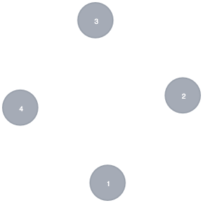
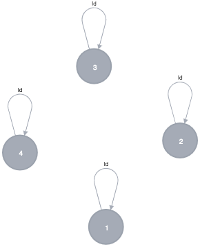
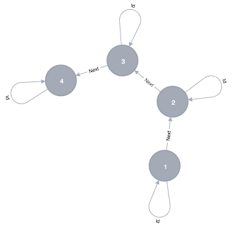
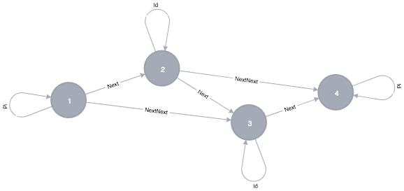
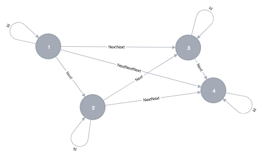
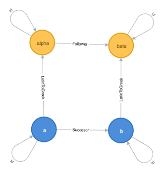
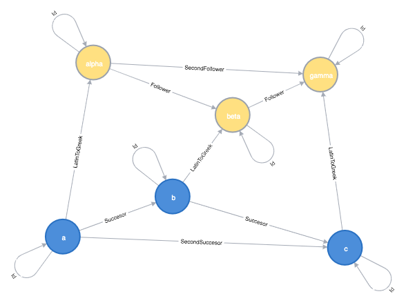
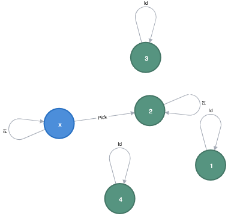
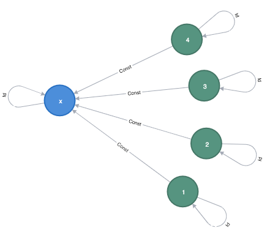

class: middle, center

# Functor for programmers

Introduction to theory category

Aleksander Lisiecki

---
# Category

Consists of:

 - Objects (dots)
 - Morphisms (arrows)

---
# Category representing a _set_

A _set_ is a collection od elements.
Try thinking of a category which represents a _set_.

.center[  ]

Is it good enough?

Are we lacking something?

---
# Improved category representing a _set_

Lets add an identity function (id) to each of the objects:

.center[  ]

---
# Category representing a _list_

A list of elements of any type _a_ can be defined as:

```haskell
data List a = End | Elem a ( List a ) deriving (Show)
```

| List | Representation |
|---|---|
| [] | End |
| [ 1 ] | Elem 1 End |
| [ 1, 2, 3 ] | Elem 1 (Elem 2 (Elem 3 End)) |
| [ [] ] | Elem End End |
| [ [ 1 ], [2, 3] ] | Elem (Elem 1 End) (Elem 2 (Elem 3 End))) |

Read more about [defining data types](http://learnyouahaskell.com/making-our-own-types-and-typeclasses) in Haskell.

---
# Category representing a _list_

Lets just consider a following list:
_[ 1, 2, 3, 4 ]_

.center[  ]

We need identity arrows to make it a category, which we've learned from the set example.
Do we need anything more to make it a category?

---
# Category representing a _list_ with a composition

.center[  ]

---
# Category representing a _list_ with a composition 2

.center[  ]

**SUCCESS!**

---
# A Functor

A functor is a mapping between two categories which _preserves a structure_.

How to preserve a structure? -> By preserving a composition.

.center[  ]

```haskell
Succesor -> Follower
```
---
# Preserving a structure

.center[  ]

```haskell
(("a") -Succesor-> ("b")) -LatinToGreek-> (("alpha") -Follower-> ("beta"))
...
```
---
# Preserving a composition
Lets now consider _SecondFollower_ arrow:

```haskell
-- First lets notice that:
Follower = LatinToGreek Succesor

-- So:
Follower "alpha" "beta" = LatinToGreek (Succesor "a" "b")
Follower "beta" "gamma" = LatinToGreek (Succesor "b" "c")

-- Next:
-- On one hand it is a composition of _Follower_ *alpha* to *beta* and _Follower_ *beta* to *gamma*:

SecondFollower "alpha" "gamma" =
    (Follower "beta" "gamma") . (Follower "alpha" "beta")

-- Using top equality we may say:
SecondFollower "alpha" "gamma" =
    (LatinToGreek (Succesor "b" "c")) . (LatinToGreek (Succesor "a" "b"))

-- On the other hand it is a result of using _LatinToGreek_ functor to the _SecondSuccesor_:

SecondFollower "alpha" "gamma" =
    LatinToGreek (SecondSuccesor "a" "c")

-- Using the two equalities above we may conclude that:
LatinToGreek (SecondSuccesor "a" "c") =
    (LatinToGreek (Succesor "b" "c")) . (LatinToGreek (Succesor "a" "b"))
```

---
# Picking Functor Example

.center[  ]

---
# Constant functor

.center[  ]

---
# Endofunctor

A functor that maps a category to that same category.

---
# Functor in programming

In Haskell type constructor is total mapping fo types and functions.
In other programing languages it is called parameterized types, templates or generic types.

---
# Defining a functor for Maybe

```haskell
data Maybe a = Nothing | Just a

fmap :: (a -> b) -> (Maybe a -> Maybe b)
fmap f Nothing = Nothing
fmap f (Just a) = Just (f x)
```

But is this definition a functor?

We need to proof 2 elements:
```haskell
fmap id = id
fmap (g . f) = (fmap g) . (fmap f)

```
---
# Refactoring

## Inlining

Manual or compiler optimization that replaces a function call site with the body of the called function.

## Reusing

Extracting common parts of code to methods/functions.

## Functions equality

Two functions are equal when for the same arguments they return the same results.

---
# Proving that our fmap is a functor for Maybe - Identity

```haskell
-- First case: Nothing
fmap id Nothing = Nothing -- from fmap definition
id Nothing = Nothing -- from id definition

-- from the two equations above we may conclude:
fmap id Nothing = id Nothing

-- so
fmap id = id
```

```haskell
-- Second case: Just x
fmap id (Just x) = Just (id x) -- from fmap definition
id x = x -- from id definition
id (Just t) = Just t -- from id definition

-- from the two equations above we may conclude:
fmap id (Just x) = (Just (id x)) = id (Just (id x)) = id (Just x)

-- so
fmap id = id
```
**SUCCESS!**

---
# Proving that our fmap is a functor for Maybe - Composition

```haskell
-- we need to show that: fmap (g . f) = (fmap g) . (fmap f)
-- lets consider the Nothing case

-- from fmap definition
fmap (g . f) Nothing = Nothing
fmap g Nothing = Nothing
fmap f Nothing = Nothing

-- from composition definition
(fmap g) . (fmap f) Nothing = fmap g (fmap f Nothing) = fmap g (Nothing) = Nothing
```

```haskell
-- from fmap definition
fmap (g . f) (Just x) = Just ((g . f) x)

-- from composition definition
Just ((g . f) x) = Just ((g (f x))

-- from composition definition
(fmap g) . (fmap f) (Just x) = fmap g (fmap f (Just x))

-- from fmap definition
fmap g (fmap f (Just x)) = fmap g (Just (f x)) = Just (g (f x))
```

---
# The end
